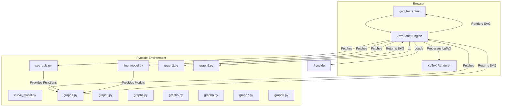
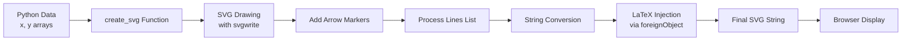
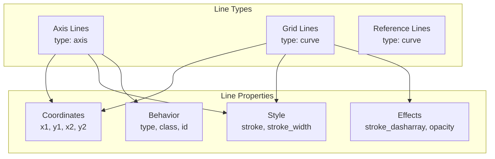
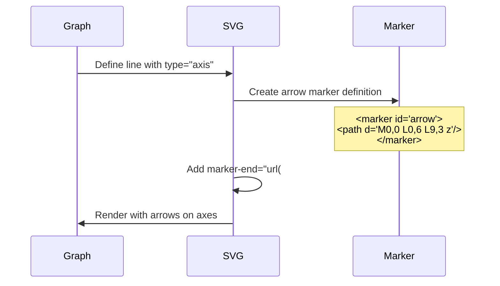

# Mathematical Curve Visualizer with LaTeX Injection

A modular system for creating mathematical visualizations with embedded LaTeX annotations using Pyodide, SVG, and KaTeX.

## Overview

This project demonstrates a clever technique for embedding LaTeX mathematical expressions directly into SVG graphics generated from Python code running in the browser via Pyodide. The system now features a unified line management approach where all lines (including axes) are defined in a single flat list.

## Architecture



## Key Changes in Latest Version

### 1. Unified Line Management
- **All lines are now defined in a single flat `lines` list** - axes, grids, and custom lines
- **Removed `axes_color` parameter** - axes colors are now hardcoded in each line definition
- **Added `show_axes=False`** to all graph functions to disable automatic axis generation

### 2. Arrow Support for Axes
Lines can now have arrows at their endpoints using the `type` field:
- `type: "axis"` - Adds an arrow marker to the line end
- `type: "curve"` - No arrow (default)

To disable arrows on specific axes, add the `no-arrow` class:
```python
{
    "type": "axis",
    "class": "axis y-axis no-arrow",  # Arrow disabled despite type="axis"
}
```

### 3. Pydantic Models
Two new models provide type safety and validation:
- **`Line` model** (`line_model.py`) - For defining lines with validation
- **`CurveDefinition` model** (`curve_model.py`) - For future curve management

## How It Works

### 1. SVG Generation Pipeline



### 2. Line Definition System



### 3. Arrow Marker System



## File Structure

```
experiments/multi-tentative/
├── grid_tests.html      # Main HTML file with grid layout
├── svg_utils.py         # Core SVG generation functions with arrow support
├── line_model.py        # Pydantic model for Line validation
├── curve_model.py       # Pydantic model for Curve definition
├── line_object.py       # Original Line class implementation
├── foreign_object.py    # ForeignObject implementation
├── graph1.py           # Identity functions on [-1, 1]
├── graph2.py           # Identity functions on [-2, 2]
├── graph3.py           # Identity functions on [-3, 3]
├── graph4.py           # Identity functions on [-4, 4]
├── graph5.py           # Parabola with annotations
├── graph6.py           # Sine wave
├── graph7.py           # Gaussian curve
├── graph8.py           # Cubic function
├── graph9.py           # Circle (parametric)
└── README.md           # This file
```

## Line Model (Pydantic)

```python
from line_model import Line, LineType

# Create an axis line with arrow
x_axis = Line(
    x1=-5,
    y1=0,
    x2=5,
    y2=0,
    stroke="#333333",
    stroke_width=2,
    class_="axis x-axis",
    type=LineType.AXIS  # Adds arrow
)

# Convert to dict for SVG functions
line_dict = x_axis.dict(by_alias=True)
```

### LineType Enum
- `LineType.AXIS` - Line with arrow marker at end
- `LineType.CURVE` - Regular line without arrow (default)

## Graph Examples

### Basic Graph with Custom Axes

```python
# Graph with custom axes and reference lines
x = np.linspace(-2, 2, 100)
y = x**2

# Define all lines including axes
lines = [
    # X-axis with arrow
    {
        "x1": -2,
        "y1": 0,
        "x2": 2,
        "y2": 0,
        "stroke": "#333333",
        "stroke_width": 2,
        "class": "axis x-axis",
        "type": "axis"  # Arrow at end
    },
    # Y-axis with arrow
    {
        "x1": 0,
        "y1": -0.5,
        "x2": 0,
        "y2": 4.5,
        "stroke": "#333333",
        "stroke_width": 2,
        "class": "axis y-axis",
        "type": "axis"  # Arrow at end
    },
    # Reference line
    {
        "x1": -2,
        "y1": 2,
        "x2": 2,
        "y2": 2,
        "stroke": "#cccccc",
        "stroke_width": 1,
        "stroke_dasharray": "3,3",
        "class": "reference-line"
        # No type field - defaults to "curve" (no arrow)
    }
]

svg_output = create_svg(
    x_data=x,
    y_data=y,
    size=335,
    lines=lines,
    show_axes=False  # Important: disable automatic axes
)
```

### Multiple Curves with Custom Colors

Each graph now has its own color scheme with axes colors hardcoded:

- **graph1.py**: Dark blue-grey axes (#3a3d47)
- **graph2.py**: Dark warm grey axes (#342f26)
- **graph3.py**: Very dark purple axes (#25202a)
- **graph4.py**: Almost black with yellow tint (#1f1b14)
- **graph5-9.py**: Standard dark grey axes (#333333)

## Core Functions

### `create_svg(x_data, y_data, size=400, foreign_objects=None, lines=None, bg_color='white', ...)`

Creates a single-curve SVG with optional LaTeX annotations and custom lines.

**Key Parameters:**
- `lines`: List of line definitions (dicts or Line objects)
- `show_axes`: Set to False when providing custom axes in lines
- `foreign_objects`: LaTeX annotations

### `create_multi_curve_svg(x_data, y_data_list, size=400, colors=None, lines=None, ...)`

Creates an SVG with multiple curves and shared line definitions.

## Line Definition Format

Lines can be defined as dictionaries with these fields:

```python
{
    "x1": float,              # Start X coordinate
    "y1": float,              # Start Y coordinate
    "x2": float,              # End X coordinate
    "y2": float,              # End Y coordinate
    "stroke": str,            # Color (e.g., "#333333")
    "stroke_width": float,    # Width in pixels
    "stroke_opacity": float,  # Optional: 0-1
    "stroke_dasharray": str,  # Optional: "5,5" for dashed
    "class": str,            # Optional: CSS class
    "id": str,               # Optional: Element ID
    "style": str,            # Optional: Inline styles
    "type": str              # Optional: "axis" or "curve"
}
```

## CSS Classes for Lines

- `.axis`: Base class for axis lines
- `.axis.x-axis`: X-axis specific styling
- `.axis.y-axis`: Y-axis specific styling
- `.no-arrow`: Disables arrow marker on axis lines
- `.reference-line`: Reference/guide lines
- `.grid`: Grid lines

## Technical Implementation Details

### Arrow Markers

The system automatically adds SVG marker definitions:

```xml
<defs>
    <marker id="arrow" markerWidth="10" markerHeight="10" 
            refX="9" refY="3" orient="auto">
        <path d="M0,0 L0,6 L9,3 z" fill="inherit"/>
    </marker>
</defs>
```

Lines with `type="axis"` get `marker-end="url(#arrow)"` attribute.

### Coordinate Transformation

The transformation system remains unchanged but now applies to all lines uniformly:

1. Data coordinates → Normalized coordinates
2. Add padding (10% of range)
3. Scale to pixel coordinates
4. Apply margin offsets

## Migration Guide

To update existing graphs:

1. **Remove `axes_color` parameter** from function calls
2. **Add `show_axes=False`** to disable automatic axes
3. **Define axes in the `lines` list** with hardcoded colors
4. **Add `type="axis"`** to axis lines for arrows

## Browser Compatibility

- Requires modern browser with:
  - ES6+ JavaScript support
  - SVG foreignObject support
  - SVG marker support
  - CSS Flexbox
- Tested on Chrome, Firefox, Safari

## Dependencies

- **Pyodide**: Python runtime in the browser
- **NumPy**: Numerical computations
- **svgwrite**: SVG generation
- **KaTeX**: LaTeX rendering
- **Pydantic**: Data validation (optional, for type safety)

## Future Enhancements

1. Custom arrow styles (size, shape, color)
2. Arrow support for curve start points
3. Multi-segment lines with waypoints
4. Bezier curve support
5. Interactive line editing

## License

This project is part of the pca-nagini experiments and follows the parent project's license. 