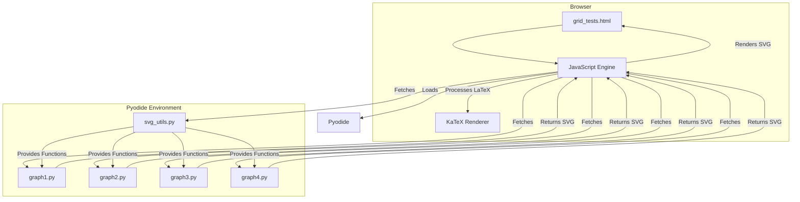
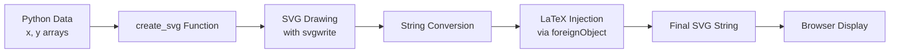
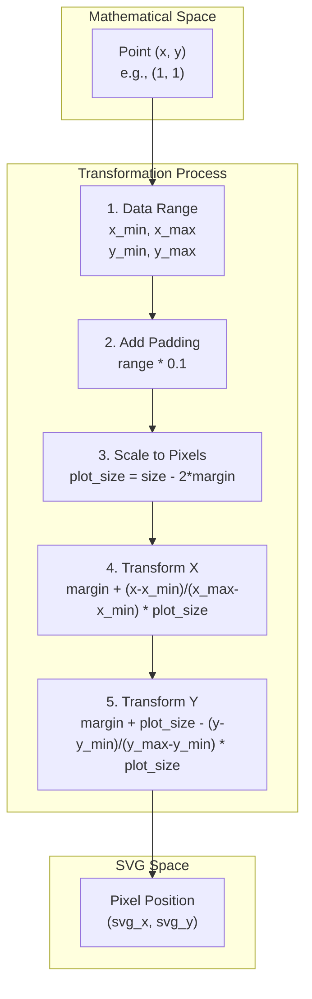
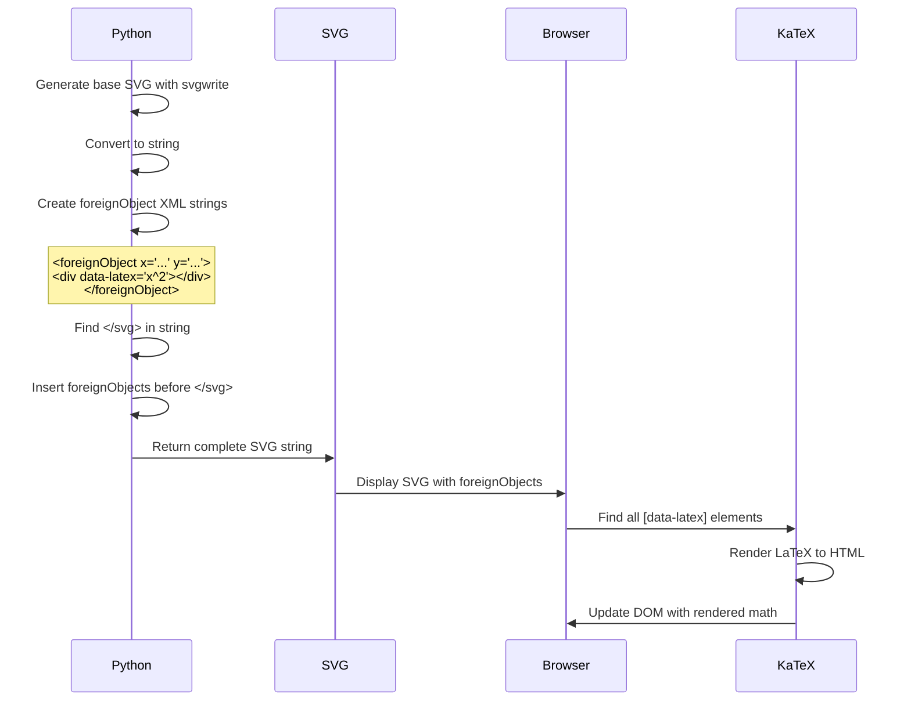

# Mathematical Curve Visualizer with LaTeX Injection

A modular system for creating mathematical visualizations with embedded LaTeX annotations using Pyodide, SVG, and KaTeX.

## Overview

This project demonstrates a clever technique for embedding LaTeX mathematical expressions directly into SVG graphics generated from Python code running in the browser via Pyodide.

## Architecture



## How It Works

### 1. SVG Generation Pipeline



### 2. Coordinate Transformation System

The system transforms mathematical coordinates to SVG pixel coordinates:



### 3. LaTeX Injection Technique

The key innovation is injecting `foreignObject` elements into SVG:



## File Structure

```
experiments/multi-tentative/
├── grid_tests.html      # Main HTML file with 2x2 grid layout
├── svg_utils.py         # Core SVG generation functions
├── graph1.py           # Identity functions on [-1, 1]
├── graph2.py           # Identity functions on [-2, 2]
├── graph3.py           # Identity functions on [-3, 3]
├── graph4.py           # Identity functions on [-4, 4]
└── README.md           # This file
```

## Core Functions

### `create_svg(x_data, y_data, size=400, latex_points=None, bg_color='white')`

Creates a single-curve SVG with optional LaTeX annotations.

**Parameters:**
- `x_data`: Array of x coordinates
- `y_data`: Array of y coordinates
- `size`: SVG size in pixels (default: 400)
- `latex_points`: List of tuples for LaTeX annotations
- `bg_color`: Background color (default: 'white')

### `create_multi_curve_svg(x_data, y_data_list, size=400, colors=None, bg_color='white', latex_points=None)`

Creates an SVG with multiple curves.

**Parameters:**
- `x_data`: Shared x coordinates for all curves
- `y_data_list`: List of y coordinate arrays
- `colors`: List of colors for curves
- Other parameters same as `create_svg`

## LaTeX Annotation Format

LaTeX annotations are specified as tuples:
```python
(x, y, latex_string, css_class, width, height)
```

Or with default size (80x30):
```python
(x, y, latex_string, css_class)
```

**Example:**
```python
latex_points = [
    (1, 1, r"x", "", 20, 20),           # Simple x at (1,1)
    (0, 0, r"O", "point", 30, 30),      # Origin with point class
    (2, 4, r"f(x)=x^2", "func", 80, 30) # Function label
]
```

## CSS Classes for Styling

- `.svg-latex`: Base class for all LaTeX elements
- `.svg-latex.point`: Point labels (red background)
- `.svg-latex.func`: Function labels (green background)
- `.svg-latex.axis`: Axis labels (bold text)

## Coordinate System Details

```mermaid
graph TB
    subgraph SVG Coordinate System
        O["Origin (0,0)<br/>Top-Left"]
        X["X increases →"]
        Y["Y increases ↓"]
    end
    
    subgraph Mathematical System
        MO["Origin (0,0)<br/>Center"]
        MX["X increases →"]
        MY["Y increases ↑"]
    end
    
    Note1["Y-axis is inverted!<br/>Math ↑ = SVG ↓"]
    
    Mathematical System --> |Transform| SVG Coordinate System
    Mathematical System -.-> Note1
```

## Example Usage

### Basic Graph with LaTeX
```python
# Graph with identity function and annotations
x = np.linspace(-2, 2, 100)
y = x

latex_points = [
    (1, 1, r"P(1,1)", "point"),
    (0, 0, r"O", ""),
    (-1, -1, r"y=x", "func")
]

svg_output = create_svg(x, y, size=335, 
                       bg_color='#e8e8e8', 
                       latex_points=latex_points)
```

### Multiple Curves
```python
x = np.linspace(-3, 3, 100)
y1 = x        # y = x
y2 = -x       # y = -x

svg_output = create_multi_curve_svg(
    x, [y1, y2], 
    size=335,
    colors=['blue', 'red'],
    bg_color='#e8e8e8'
)
```

## Key Features

1. **Pure Python SVG Generation**: No matplotlib backend needed
2. **String Injection**: Clever workaround for svgwrite's lack of foreignObject support
3. **Flexible Annotations**: Place LaTeX anywhere using data coordinates
4. **Responsive Centering**: CSS flexbox ensures proper alignment
5. **Modular Design**: Each graph is a separate Python file
6. **Browser-Based**: Everything runs in the browser via Pyodide

## Technical Details

### SVG Structure
```xml
<svg width="335" height="335">
    <rect fill="#e8e8e8" width="335" height="335"/>
    <line stroke="black" stroke-width="2"/> <!-- axes -->
    <path stroke="blue" d="M..."/> <!-- curve -->
    
    <!-- Injected LaTeX -->
    <foreignObject x="150" y="150" width="50" height="30">
        <div class="svg-latex" data-latex="x^2">
            <!-- KaTeX renders here -->
        </div>
    </foreignObject>
</svg>
```

### Margin and Scaling
- Default margin: 30px for size ≤ 335px, 40px otherwise
- Plot area: `size - 2 * margin`
- Data padding: 10% of range on each side

## Browser Compatibility

- Requires modern browser with:
  - ES6+ JavaScript support
  - SVG foreignObject support
  - CSS Flexbox
- Tested on Chrome, Firefox, Safari

## Dependencies

- **Pyodide**: Python runtime in the browser
- **NumPy**: Numerical computations
- **svgwrite**: SVG generation
- **KaTeX**: LaTeX rendering

## Future Enhancements

1. Add more curve types (parametric, polar)
2. Interactive annotations (hover/click)
3. Animation support
4. Export to PNG/PDF
5. 3D visualization support

## License

This project is part of the pca-nagini experiments and follows the parent project's license. 